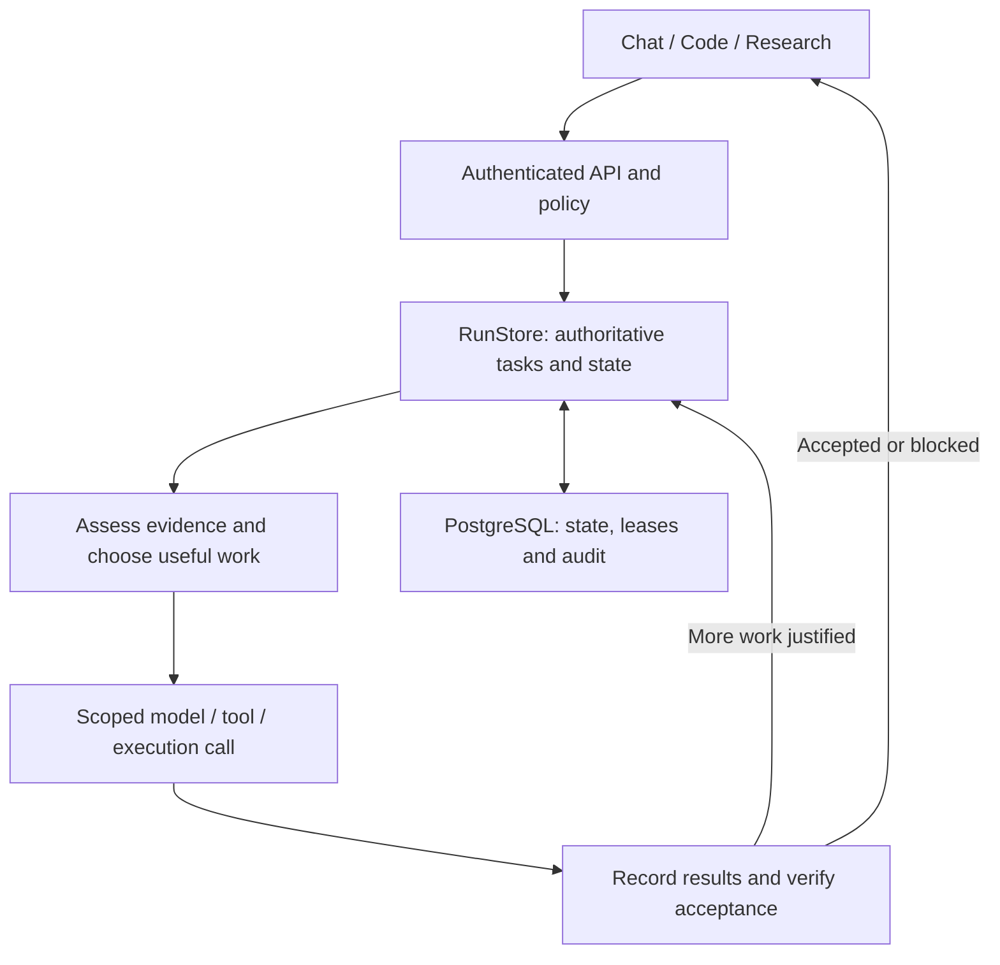

# Kindgleam (KG)

Kindgleam is an adaptive AI application for everyday work, software projects and evidence-driven research. It uses one server-owned runtime across three workspaces, with Google Vertex AI Gemini as its model boundary.

The system starts with the smallest useful action. It adds investigation, tools, execution or advisory specialists when current evidence and the user's goal justify them. RunStore owns task state, permissions and completion; a model or browser cannot authorize its own work.

## Application workspaces

| Workspace | What people use it for | Application behavior |
| --- | --- | --- |
| Normal Chat | Daily conversation, learning, demanding reasoning, business planning, writing, design and lightweight file work | Adaptive reasoning depth, scoped attachments, artifact previews and authorized tools; optional configured sandbox execution |
| Code | Repository-scale engineering | GitHub project sources, indexed context, revision-checked patches, durable project sessions, verification and an optional isolated terminal |
| Research | Investigation and source-heavy work | Source provenance, evidence gaps, conflicting findings and scoped investigator/analyst/critic assistance |

One conversation continues across these three workspaces. Each has its own controller policy and scoped task context, with a shared runtime enforcing permissions, budgets and verification. Mixed tasks use the capabilities they need. Task-aware suggestion banners appear across all three workspaces, even without attached files. Complex coding suggests Code, investigation suggests Research, and clearly lightweight new work can suggest Normal Chat. The switch button preserves the draft and selected files; switching remains an optional user action.

Normal Chat is the everyday starting point: conversation, tutoring and educational problem-solving, demanding mathematical reasoning, business ideas and plans, presentations, decisions and multi-file editing are native work here. Reasoning effort adapts from direct to focused or deep without requiring a workspace switch or automatically recruiting agents. A routine current-fact question can use authorized web evidence in Chat; thesis-scale source investigation belongs in Research. The [Normal Chat task profile](src/normal-chat-task-profile.js) advises reasoning/context and verification only; it cannot authorize tools, execution or memory.

Normal Chat supports up to ten attachments per browser message, each up to 5 MB. Previews show artifacts; actual execution requires a configured runner and recorded execution evidence. Code Workspace accepts GitHub repositories; its sessions and terminal require an attached GitHub source.

The browser and server share [request-intent hints](public/workspace-intent.js): teaching Python or planning an API startup stays in Chat; researching GitHub adoption belongs in Research; updating a repository belongs in Code. Explicit workspace requests take precedence. Recommendations are bounded heuristics, and a small code bundle can suggest Code while remaining supported in Chat. Selected attachment names reach the task controller without copying document contents into its policy. On a workspace or project change, conversation history stays available while implicitly inherited controller state, project identity and file overlays are discarded. Explicitly supplied context remains subject to the existing authorization checks.

## One adaptive architecture



This is a feedback relationship, not a required sequence of reasoning phases. The planner initially creates the current work item. RunStore grows or revises actual work from observed results, missing capabilities, changed requirements and verification outcomes.

| Responsibility | Implementation |
| --- | --- |
| Process lifecycle and service wiring | [server.js](server.js), [src/app.js](src/app.js) |
| Initial planning and authoritative task transitions | [src/core.js](src/core.js), [src/runs.js](src/runs.js) |
| Durable background jobs and project fleet | [src/jobs.js](src/jobs.js), [src/fleet-control.js](src/fleet-control.js) |
| Shared decision, acceptance and recovery policy | [src/unified-adaptive-workflow.js](src/unified-adaptive-workflow.js), [src/adaptive-decision-authority.js](src/adaptive-decision-authority.js) |
| Advisory topology and actual specialist dispatch | [src/adaptive-agents.js](src/adaptive-agents.js), [src/multi-agent.js](src/multi-agent.js), [src/agent-lane-executor.js](src/agent-lane-executor.js) |
| Model calls, admission, usage and provider limits | [src/runtime.js](src/runtime.js), [src/model-routing.js](src/model-routing.js) |
| Scoped context, procedures and memory | [src/universal-context.js](src/universal-context.js), [src/agent-harness.js](src/agent-harness.js), [src/skills.js](src/skills.js), [src/memory.js](src/memory.js) |
| Safe view of current work | [src/persisted-task-projection.js](src/persisted-task-projection.js), [src/open-world-task-graph.js](src/open-world-task-graph.js) |

The graph projection is a bounded, read-only view of persisted tasks and proposed actions. It does not dispatch tools, queue work or accept model-reported completion. The [canonical architecture guide](docs/ARCHITECTURE.md) explains these boundaries and the application services.

## Efficient work and reliable outcomes

A straightforward question should stay on the direct path. Optional specialists are recruited only when independent work, uncertainty or quality requirements justify their overhead. Chat, Code and Research share budget rules, with workspace-specific role selection and effort policies.

Specialist calls receive bounded task scope and advisory authority. Independent lanes may run concurrently within hard ceilings; dependencies and file/resource conflicts constrain scheduling. Started peers are settled before a failed or cancelled wave returns. The parent integrates findings and the server retains verification and completion gates.

Skills provide relevant procedures and required evidence. Memory recall is authorized and scoped by principal, workspace and project; recalled text cannot grant permissions. New requirements can reopen affected work while preserving unrelated verified results. Recovery uses the shared decision authority and bounded run attempts.

Actual quality and efficiency are measured as accepted outcomes, tokens, cost, latency and recoverability. A deterministic policy test does not establish live Gemini answer quality or production readiness.

## Local development

Use Node.js 22 or newer, npm, PostgreSQL and a C++ build toolchain if your platform needs to build `node-pty`. Docker Compose can provide the development database. Configuration is validated from process environment; the application does not automatically load `.env`.

1. Install dependencies with `npm ci`.
2. Copy `.env.example` to `.env`, choose a development database password and set `DATABASE_URL`. For the supplied Compose database, use user/database `kindgleam`, the selected password, host `127.0.0.1` and port `5432`. In development, leave `DATABASE_MIGRATION_URL` empty to use that same database identity.
3. Start the database with `docker compose up -d db`, or provide your own PostgreSQL server.
4. Configure `GOOGLE_CLOUD_PROJECT` and an explicit temporary `VERTEX_ACCESS_TOKEN` for local development. The runtime uses that token or the Google metadata server in a supported hosted environment; it does not load local ADC credential files. Keep model selection within the server's approved Gemini catalog.
5. Migrate, create the first workspace/account and start the application:

```bash
node --env-file=.env bin/admin.js migrate
node --env-file=.env bin/admin.js bootstrap --workspace personal --name "Administrator"
node --env-file=.env server.js
```

Open `http://localhost:3000`. Bootstrap displays the initial API key once; store it privately. See [.env.example](.env.example) for available settings and [production readiness](docs/PRODUCTION_READINESS.md) for the production deployment sequence. The supplied Compose app configuration is a development baseline; it does not forward every optional model/runner setting.

Tool routing, sandbox execution and interactive terminal support have separate configuration and isolation requirements. Without configured execution infrastructure, the application reports unavailable execution rather than claiming work ran. See [sandbox and tools](docs/SANDBOX_AND_TOOL_FORGE.md).

## Verification

```bash
npm run check
npm run lint
npm run doctor
npm run eval:skills
npm run eval:adaptive-matrix
npm test
```

`npm run verify` runs source checks, doctor, skill evaluation, lint and the complete test suite. Database-backed tests need `TEST_DATABASE_URL` pointing at a PostgreSQL identity that can create/drop isolated test databases. GitHub Actions provides this environment; keep it separate from production data.

| Check | Evidence it provides |
| --- | --- |
| Unit tests and adaptive matrix | Control decisions, scope, budgets, graph consistency, concurrency and recovery behavior |
| PostgreSQL integration tests | Persisted transitions, leases, tenant boundaries, migrations and real application integration |
| `npm run test:ui` | Browser interactions in a configured application |
| `npm run smoke:providers` and `npm run eval:live` | Credentialed provider behavior and evaluated live outputs |
| Container and operational checks | Deployment configuration, boot, shutdown and backup/restore behavior |

## Documentation

- [Architecture and application services](docs/ARCHITECTURE.md)
- [Simple adaptive workflow and one privacy/policy gate](docs/SIMPLE_ADAPTIVE_POLICY.md)
- [Three-workspace adaptive policy](docs/WORKSPACE_ADAPTIVE_POLICY.md)
- [Specialist dispatch and boundaries](docs/UNIFIED_ADAPTIVE_AGENTIC_ARCHITECTURE.md)
- [Runtime state, cancellation and recovery](docs/UNIFIED_ADAPTIVE_RUNTIME.md)
- [Open-world graph implementation and limits](docs/OPEN_WORLD_ADAPTIVE_ARCHITECTURE.md)
- [Hierarchical specialist scope](docs/HIERARCHICAL_ADAPTIVE_SPECIALISTS.md)
- [Coding production validation](docs/CODING_PRODUCTION_VALIDATION.md)
- [Live evaluation](docs/LIVE_EVALUATION.md)
- [Production readiness](docs/PRODUCTION_READINESS.md)

The current architecture removes the unused phase-advancement controller, duplicate generic agent executor and unused recovery/harness facades. Existing task data, migrations and active API contracts remain supported. Live quality/cost calibration and distributed endurance testing remain deployment work; the repository does not claim a universally best or 10/10 system.
