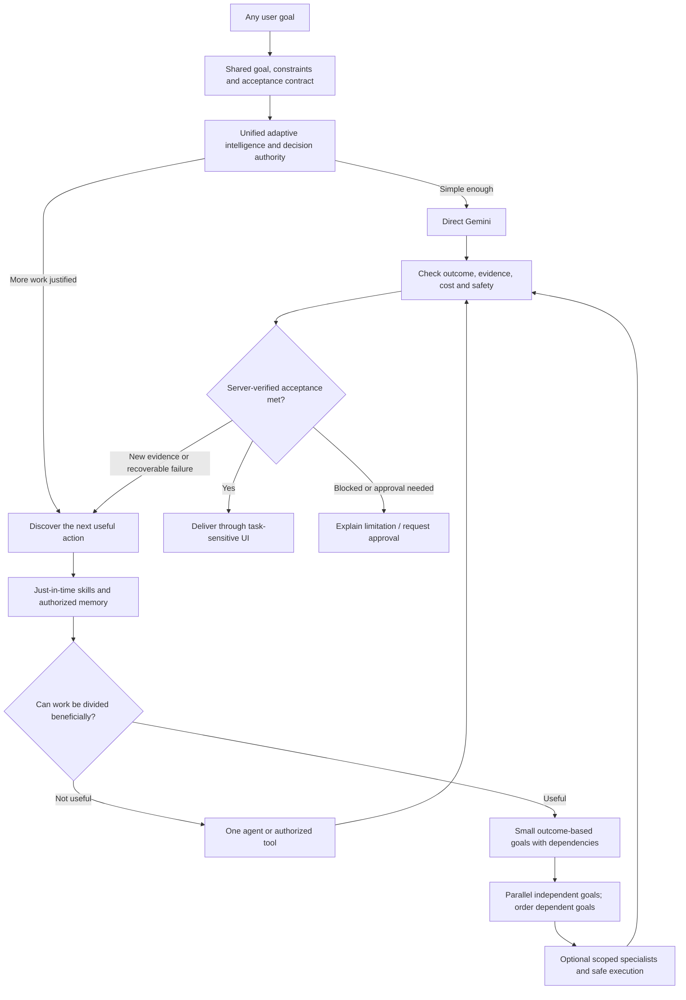

# Kindgleam (KG)

**One unified, situation-adaptive intelligence for any user goal.** KG aims for high-quality results with the *minimum sufficient* reasoning, context, tools, memory, agents and execution.

Kindgleam does not make every user request follow a fixed pipeline or recruit a permanent team. It chooses the next justified action from the **actual goal, verified state, uncertainty, dependencies, authorizations, quality requirements and available budget**. Production reasoning is designed for the approved Google Vertex AI Gemini family.

> **Verification is not a slogan.** Passing CI or an orchestration policy benchmark does not mean live Gemini outputs are correct or the deployment is production-ready. See [release requirements](docs/PRODUCTION_READINESS.md) and [live model evaluation](docs/LIVE_EVALUATION.md).

## System architecture



**One intelligence, three user-facing surfaces.** Normal Chat is the default for conversation, brainstorming, writing, learning, planning, design, images and lighter engineering questions. Code Workspace manages durable project files, revisions, targeted edits and execution. Research Workspace organizes source provenance, evidence conflicts and deeper investigation. The surfaces are **not separate AI brains**, and mixed-domain tasks are not restricted to one preset category.

**Adaptive specialization varies by workspace:** Normal Chat uses a direct-first, minimum-sufficient response policy. Code adds task-specific architect/implementer/debugger/test/security specialists when complexity warrants them. Research adds independent source-discovery, analyst and critic roles when they can meaningfully improve evidence coverage. Difficulty alone never authorizes parallel work; the controller needs a declared independent-work opportunity and the server scheduler must enforce task dependencies and conflicts. Low budgets reduce optional panels, and satisfied acceptance criteria stop further expansion. See [three-workspace adaptive policy](docs/WORKSPACE_ADAPTIVE_POLICY.md).

## Normal Chat: files, previews and an on-demand sandbox

Normal Chat can handle a **single file or a small set of files together**
(up to 10 files per message in the browser client, each up to 5 MB):
documents, tables, images, code and lightweight transformations.
Selected attachments remain scoped to the current message; outputs can be
reviewed through the shared artifact preview (images, PDFs and extracted
text/table summaries). A preview is never proof that a file was executed.

**Sandbox execution is optional and server governed.** When the separate
sandbox runner is configured, code tasks can use an isolated temporary
container to check/run code and tests, including small multi-file scripts,
and produce downloadable result files. The UI reflects **configured**
sandbox availability rather than inventing execution success.
The execution phase has no network, restricted filesystem writes, resource
limits, and no access to the host environment; see
[Sandbox and tool guide](docs/SANDBOX_AND_TOOL_FORGE.md).
No sandbox is started for ordinary conversation.

When the user's request becomes repository-scale engineering or thesis/source
heavy research, Normal Chat **suggests** Code or Research as an optional
workspace. A suggestion does not send a message, move the attachments, or grant
tool permissions. The user can continue lightweight multi-file work in Normal
Chat; project-scale execution continues under existing server-side policies.

## Dynamic task decomposition and parallel execution

**KG should split a task into smaller goals only when doing so is more likely to improve quality, speed, recoverability or verification than it costs in extra coordination.** One Gemini call should remain the default when sufficient.

- A sub-goal has a distinct outcome, required evidence, prerequisite IDs, bounded context, capabilities and acceptance checks—not merely a generic "thinking" step.
- The controller adds the **next useful work unit**, rather than prebuilding a long task graph from a domain label.
- Independent, conflict-free work can be executed concurrently **within provider, token and resource limits**. Dependent operations wait for verified predecessors; conflicting file writes are serialized.
- Partial failures trigger targeted diagnosis or retry, not an automatic restart of successful, independent work.
- New user requirements or corrected evidence invalidate only affected downstream results. Graph revisions detect stale edits.
- High-risk and consequential actions retain authorization and verification gates. More agents never create more privileges.
- A supervisor must integrate and verify results before final delivery. Specialists are advisory; the server owns execution, state and completion.

**Example — repair an application without breaking existing features:** inspect the affected modules and independently review test coverage; implement a minimal revision-checked change; run regression tests; investigate only failures; report the changed files and real test output. Inspecting disjoint modules can be parallel; applying interdependent schema/API changes usually cannot.

The incremental graph and decision projection live in [`src/open-world-task-graph.js`](src/open-world-task-graph.js) and [`src/unified-adaptive-workflow.js`](src/unified-adaptive-workflow.js). [`src/persisted-task-projection.js`](src/persisted-task-projection.js) mirrors the **actual persisted run tasks** at creation and after task advancement in the same transaction, with a bounded, privacy-safe graph. **This graph remains a read-only proposal/view layer**: the RunStore executes and authorizes real tasks, never the UI projection. See [open-world implementation status](docs/OPEN_WORLD_ADAPTIVE_ARCHITECTURE.md).

## Skills, memory and dynamically recruited agents

| Capability | Purpose | Boundary |
| --- | --- | --- |
| Skills | Reusable methods, prerequisites and expected evidence | Only relevant instructions are selected; skills do not grant permissions |
| Working/conversation memory | Current task decisions and progress | Authorized chat scope |
| Project memory | Verified project state, files, history and architecture | Principal, workspace and project isolation |
| Cross-chat user memory | Authorized persistent preferences/continuity | User-controlled; never automatically crosses tenant boundaries |
| Experience learning | Compare validated approaches for future tasks | Do not promote unverified agent claims into permanent procedures |
| Temporary specialists | Domain expertise or independent checking when valuable | Bounded advisory assignments; least privilege |

KG uses [skill selection](src/skills.js), [memory](src/memory.js), [task-bound assignments](src/task-specialization.js), [agent recruitment](src/multi-agent.js), [agent budgets](src/agent-topology-policy.js) and [parallel scheduling](src/parallel-orchestrator.js). Role count, context, token spending and fan-out are decisions, **not default quotas to exhaust**.

## Execution, verification, and cost

- **Direct path:** answer straightforward questions with the minimum viable model work.
- **Adaptive path:** retrieve necessary context, skills, tools or external evidence only when the task requires them.
- **Deep path:** break large or unfamiliar tasks into justified sub-goals; use scoped specialists and dependency-safe concurrency only where benefits exceed overhead.
- **Feedback loop:** execute, inspect actual tool/model results, verify the user's acceptance conditions, recover or finish.
- **Improvement loop:** use versioned evaluation to propose skill/strategy changes, test regressions, and roll back harmful changes before promotion.

Optimize for **cost per verified accepted result** subject to quality, latency, user control, safety and privacy—not maximum parallelism or minimum tokens in isolation. Real provider costs and p50/p95 latency require measured Vertex traffic.

## Coding and research workspaces

**Code Workspace** combines project indexing, context compilation, exact revision checks, scoped patches, real tests and safe code-delivery options. See [coding workflow](src/code-workflow.js), [revision-safe patching](src/workspace-patch.js) and [coding validation](docs/CODING_PRODUCTION_VALIDATION.md).

**Research Workspace** separates sourced claims from uncertainty, unresolved questions and conflicting findings. External sources and tool output are treated as untrusted data rather than instructions or authority.

**Normal Chat** can render task-relevant progress and outcomes without requiring an extra mode for each user task. Workspaces and dynamic UI never grant permissions.

## Security and operational boundaries

KG's PA-ONE-X defense-in-depth design includes authenticated workspace authorization, PostgreSQL Row-Level Security, separate encryption domains, immutable audit events, scoped tool and sandbox execution, user approval, and fail-closed policy checks. Run ownership, resource budgets, idempotency and final completion remain **server-side**.

Production additionally requires confirmed private networking, secure credentials, database recovery, tenant-isolation tests, monitoring and verified backups. User content and retrieved memories cannot rewrite policy or make their own tools authorized.

## Testing — what each result proves

With dependencies installed, the standard repository checks are:

```bash
npm ci
npm run check
npm run lint
npm test
npm run verify
```

| Evaluation | Command | Evidence |
| --- | --- | --- |
| 17 known and unfamiliar task-routing scenarios | `npm run eval:adaptive-matrix` | Deterministic controller choices: direct answers, investigation, missing capabilities, budgeting, approval, recovery and revisions |
| Executable pricing bug regression | `npm run smoke:coding` | Project-context and revision-checked patch plus Node tests before/after a **supplied** fix |
| Skill evaluation | `npm run eval:skills` | Selection/evaluation contract behavior |
| Real Vertex API smoke | `npm run smoke:providers` | Actual provider request only when **securely configured**; a skipped smoke is not a pass |
| 35 real-model user scenarios | `npm run eval:live` | End-to-end KG answers, workflow, tools, latency and tokens **only with a running authorized deployment** |

**Live provider evaluation is not equivalent to the 17 deterministic scenarios.** The deterministic tests do not generate Gemini answers, images, external research, or autonomous coding patches.

### Secure Gemini configuration

KG's supported production provider route is **Vertex AI**, configured with a Google Cloud project and appropriately scoped cloud identity/token. The provider-smoke GitHub workflow reads secure repository secrets (`SMOKE_GOOGLE_CLOUD_PROJECT`, `SMOKE_VERTEX_ACCESS_TOKEN`) rather than accepting API keys in source files. For the full live evaluation, the configured deployment/test workspace uses `EVAL_URL`, `EVAL_TOKEN` and `EVAL_WORKSPACE`; see [docs/LIVE_EVALUATION.md](docs/LIVE_EVALUATION.md).

**Never paste provider keys into issues, commits, chats, test fixtures or logs.** If a credential has been disclosed, revoke/rotate it and configure the replacement in a secret manager. A Google AI Studio/Developer API key should not be assumed to authenticate KG's Vertex AI provider workflow.

## Documentation and current scope

- **Canonical product architecture:** [docs/ARCHITECTURE.md](docs/ARCHITECTURE.md)
- **Open-world graph and remaining integration work:** [docs/OPEN_WORLD_ADAPTIVE_ARCHITECTURE.md](docs/OPEN_WORLD_ADAPTIVE_ARCHITECTURE.md)
- **Production release gates:** [docs/PRODUCTION_READINESS.md](docs/PRODUCTION_READINESS.md)
- **Live Gemini evaluation (35 scenarios):** [docs/LIVE_EVALUATION.md](docs/LIVE_EVALUATION.md)
- **Coding regression validation:** [docs/CODING_PRODUCTION_VALIDATION.md](docs/CODING_PRODUCTION_VALIDATION.md)
- **Privacy and settings authority:** [docs/CONTROL_PLANE_HARDENING.md](docs/CONTROL_PLANE_HARDENING.md)

**One intelligence. One authoritative adaptive loop. Small goals when useful. Parallel only when safe. Real evidence. Minimum sufficient cost.**
