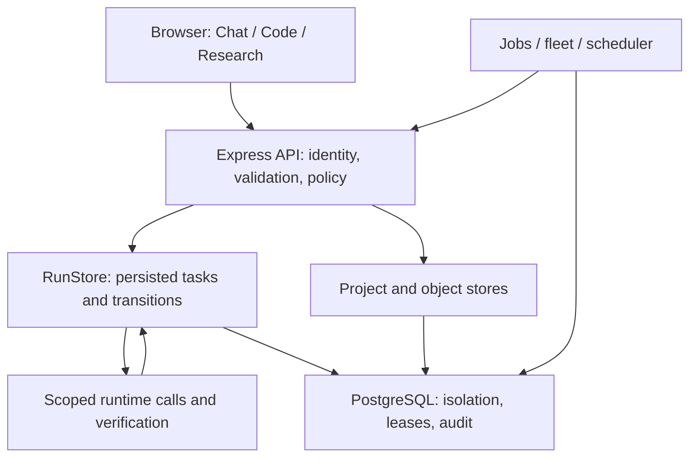

# Kindgleam architecture and application system

This is the canonical description of the implemented application. Kindgleam has one incremental, server-owned workflow, three workspaces and a Vertex Gemini model boundary. Planning and context projections advise the runtime; they do not execute work or grant authority.

## Application services

`server.js` validates configuration, constructs shared services, checks database readiness and starts HTTP plus background workers. `src/app.js` wires routes and the common execution entry point. Identity and workspace membership control access. ProjectStore and ObjectStore hold durable project/artifact state; RunStore owns runs and real tasks. JobStore, fleet workers and Scheduler deliver background work through that same execution path.

The browser presents saved state, scoped context, previews and optional user actions. It cannot change authority through a workspace selection, proposed task, specialist finding or UI status.

## Responsibility and authority

| Layer | Modules | Authority |
| --- | --- | --- |
| Initial planning | `core.js`, `adaptive.js` | Creates the current task and goal/context contracts; `decideAdvance` validates existing task transitions |
| Run execution state | `runs.js` | Locks and updates persisted tasks; adapts next work, applies recovery and enforces completion |
| Decision policy | `unified-adaptive-workflow.js`, `adaptive-decision-authority.js` | Pure acceptance, capability, budget and recovery decisions enforced by RunStore |
| Situation/context | `unified-adaptive-intelligence.js`, `universal-context.js`, `reasoning-context.js` | Describes evidence, uncertainty, effort and useful resources; schedules no phases |
| Mode and compute policy | `mode-controllers.js`, `agent-topology-policy.js`, `adaptive-efficiency.js` | Shared ceilings and workspace-specific optional effort; unknown budget telemetry remains distinct from exhausted budget |
| Advisory topology | `adaptive-agents.js` | Describes logical assignments and dependencies; never calls providers or tools |
| Specialist execution | `multi-agent.js`, `agent-lane-executor.js`, `parallel-orchestrator.js` | Runs scoped advisory calls with ordered waves, dependency/conflict constraints and hard concurrency limits |
| Hierarchical scope | `specialist-hierarchy.js`, `subsystem-orchestrator.js`, `task-specialization.js` | Bounded role/context hints, ownership and typed findings; no independent recursive executor |
| Model/provider boundary | `runtime.js`, `model-routing.js`, `model-catalog.js` | Configured Gemini routing, usage admission, provider limits, timeouts and cancellation |
| Context procedures | `agent-harness.js`, `skills.js`, `memory.js`, `rag.js` | Relevant skills, bounded retrieval and authorized memory as data; no new permissions |
| Execution capabilities | `toolbox.js`, `sandbox.js`, `tool-forge.js`, `terminal.js` | Explicit authorized routing and configured isolation; records observed outcomes |
| Verification | `verification.js` | Evaluates evidence against acceptance; model claims alone cannot establish execution success |
| State views | `persisted-task-projection.js`, `open-world-task-graph.js`, `adaptive-runtime-state.js` | Bounded projection/history of real work and proposals; no task dispatch |

All module paths in this table are relative to `src/`.

## Incremental task lifecycle

The initial planner creates the current work item rather than a future chain for a domain. At each authoritative transition, RunStore checks the target and dependencies, records actual evidence/outcomes, reassesses the current situation and creates only justified next work. Investigation, execution and verification are conditional work types, not mandatory reasoning phases.

Changed evidence, requirements, failures or verification results can reopen reasoning and affected work. Unrelated completed work remains available. Recovery decisions come from `unifiedRecoveryDecision` and the shared failure taxonomy, subject to bounded attempts, capabilities, authorization and budgets.

`run_tasks` is the scheduling source of truth. RunStore mirrors a privacy-safe open-world graph during creation and advancement in the same database transaction. The projection holds at most 48 nodes, excludes raw secrets/evidence and does not queue a proposed action. Its revision changes only with visible task changes. See [graph implementation](OPEN_WORLD_ADAPTIVE_ARCHITECTURE.md).

Persisted compatibility fields such as runtime `currentStage` identify the current task type. They do not imply a stage scheduler. Existing database migrations and task formats remain supported.

## Three workspaces, shared policies

| Workspace | Additional context and capabilities | Optional effort |
| --- | --- | --- |
| Normal Chat | Conversation, current attachments, artifact previews, configured lightweight sandbox | Direct-first; bring skills/tools/specialists only when useful |
| Code | Attached GitHub source, project index, files/revisions, context compiler, patching, isolated terminal | Architect/implementer/debugger/test/security roles when warranted by actual task scope |
| Research | Sources, provenance, conflicts, unresolved questions and research artifacts | Independent discovery, analysis and criticism when evidence coverage benefits |

The same acceptance, authorization, recovery and provider boundaries apply throughout. A workspace suggestion does not transfer files, send messages or authorize execution. Code sessions and terminal require a GitHub project source. Normal Chat can work with a small file set without creating a project workspace.

## Specialist execution and optimization

The active dispatcher is `multi-agent.js`. Topology planning is advisory: actual selected specialists are bounded by shared policy, current useful work, user opt-out and per-run ceilings. Role count is a limit, not a quota to fill. Hierarchical scope hints are depth-bounded; they do not spawn an unrestricted tree of agents.

The lane executor validates selected IDs and schedule coverage before any call. It processes waves in order and settles started peers on failure or cancellation before returning. Independent calls may run together within hard provider/token/resource ceilings. Conflicting or consequential work remains serialized by the relevant authority and lane gates.

Specialist findings are advisory and typed. The parent integrates them into the current task, and RunStore retains verification and final state transitions. Optional panels shrink under budget pressure; mandatory authorization and verification are not optional compute overhead.

Resource selection retrieves only relevant context and procedures. A shared budget ratio parser prevents missing/non-finite telemetry from silently looking like zero. Code context/indexes and learned procedures are reused within scope; new evidence determines further work. Optimize cost per accepted outcome subject to correctness and user control, then calibrate thresholds against live baselines.

## Persistence, privacy and operations

PostgreSQL stores runs, tasks, jobs, leases, project objects, account state and audit history. Row-level security and application ownership checks enforce scope. Encryption domains protect objects and sensitive personal/billing metadata; external payment details remain in Stripe's hosted flow. Production uses separate runtime, migration, backup and restore identities.

Job and fleet leases fence concurrent workers. Revision checks prevent stale file writes and stale task outcomes. Execution receipts and verification evidence remain distinguishable from proposals. Stop is persisted server state; browser disconnection alone does not stop background work. Supported provider/runner cancellation propagates, but an aborted connection does not prove an external side effect never finished.

Skills cannot authorize tools. Scoped memory and retrieved sources are untrusted data. MCP/tool adapters and remote delegation remain behind existing policy boundaries. Isolated runners have explicit configuration; unavailable capabilities stay unavailable rather than producing invented success.

Health, readiness and metrics expose operational state. Provider concurrency adapts to pressure, and retries release provider slots during bounded waits. Authentication failures are not retried as transient pressure. Consult [runtime notes](UNIFIED_ADAPTIVE_RUNTIME.md) and [production readiness](PRODUCTION_READINESS.md) for deployment details.

## Removed architecture and validation

The unused `advanceAdaptiveWorkflow` / `nextAdaptiveStage` phase engine and its coverage helpers have been removed. The unused generic `executeAdaptiveAgentPlan` executor has been removed; production specialists continue through the lane executor. Unused recovery compatibility facades and standalone harness-policy helpers have also been removed. There is no replacement competing scheduler.

Source/lint/doctor checks, focused control tests, database integration, browser checks and container checks validate different parts of this architecture. Actual Gemini correctness, outcome quality, latency and cost require credentialed live evaluation; distributed endurance requires operational trials. See [README verification](../README.md#verification) and [live evaluation](LIVE_EVALUATION.md).
