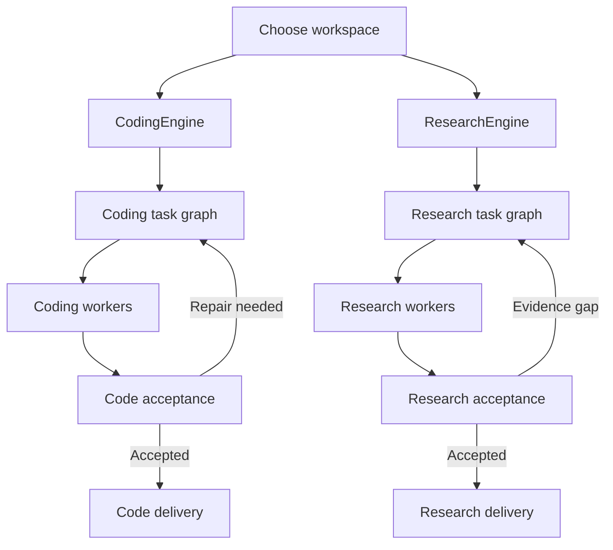

# KG — Coding, Research Papers and Thesis Work
Agreed design • implementation requested 9 October 2026

## Agreed purpose

KG is a dedicated work system for coding, research papers and thesis work. The user has explicitly removed daily conversation, general chat and generic file-assistant work from the product scope.

The product has two distinct workspaces, Coding and Research, each with its own workflow engine and project work chats. Chat is how users direct domain work; there is no everyday-chat workspace. Files remain essential inputs and outputs: repositories, papers, datasets, manuscripts, figures and experiment artifacts. Planning, brainstorming, architecture discussion and research-question development are native work in both project types.

Success means users can resume projects, produce verified code, and develop research deliverables whose claims and results can be traced to sources and experiments. The goal is to serve these workflows well, with their own measurable quality criteria.

## Enforced coding and research scope

The system serves two work domains: coding and scholarly/technical research, including papers and theses. Planning, brainstorming, mathematics, statistics, writing, translation, visualization and file operations are supported when they contribute to an in-scope task.

Research is defined by the investigative purpose and deliverable, not by the appearance of the word “research.” Academic work can include humanities and qualitative studies as well as scientific and quantitative research. Generic restaurant searches, travel plans, personal advice, entertainment and unrelated daily tasks do not become supported merely by relabeling them as research or opening a Research project.

Evaluate the current request with relevant project context and explicit user intent. The domain result is in-scope, out-of-scope, mixed, or needs clarification. An unclear short follow-up should use its active project context; ask one focused question only when the purpose remains materially ambiguous.

| Request | Response policy |
| --- | --- |
| Debug code, design software, review an API or explain an algorithm | Support coding work |
| Compare papers, design a study, analyze data, derive a model or draft a thesis section | Support research work |
| Edit or translate an academic manuscript; create figures from research results | Support the research deliverable |
| Build software about travel, finance or another topic | Support the software task; its subject alone does not make it out of scope |
| A greeting | Give a short welcome and invite a coding or research task |
| An unrelated holiday itinerary, poem or personal reminder | Politely decline the unrelated task |
| A coding task combined with an unrelated everyday request | Handle the coding part and briefly decline the unrelated part |
| “Plan this” following an in-scope project discussion | Use context and plan the relevant work |

Use a short decline such as: “Sorry, I’m designed to help with coding and research work, including papers and theses. I can help with a task in those areas.” Do not give the unrelated answer after declining or invent a research connection to continue it.

Enforce scope on the server before substantive planning, agent recruitment, retrieval, tool admission or execution. Apply it to every new message and proposed task, including continuation, external-agent results and graph expansion. Project type, tool availability and model instructions cannot override this boundary. The UI can explain the focus, but is not the enforcement layer.

The lightweight scope assessment may use the existing model boundary with no tool access. Clearly out-of-scope work must not launch specialist workers or external searches. Treat a scope decline separately from safety/abuse refusals so an ordinary unrelated request does not penalize the account. Existing safety, permissions and tenant rules remain applicable to in-scope work.

Project/account operations required to use KG remain available as product controls. They do not open a general-purpose chat pathway. Preserve out-of-scope historical messages without treating them as authorization to resume an unsupported workflow.

## Product shape

The home screen offers Coding and Research workspaces. Each shows its own projects, conversations and relevant work panels. Create a project inside the selected workspace, then use its work chat. The implementation may reuse UI components, but selection state, conversations, queues and context remain separated. Each project can have multiple work threads.

| Workspace | Main work | Contextual panels |
| --- | --- | --- |
| Coding | Software design, implementation, debugging, testing and system building | Repository/files, changes, test results, terminal and deliverables |
| Research | Literature investigation, papers, thesis chapters, methods and experiments | Sources, claim evidence, notes, datasets, figures and manuscript sections |

A Research project can execute research analysis code through its own engine and sandbox task, and a Coding project can inspect documentation or papers needed for engineering. These capabilities stay within the owning workspace; they do not silently transfer task ownership. The active workspace and project are always visible.

Do not require a repository merely to design software or write a new program. Existing-repository changes require the current source revision. New software can begin with project-owned files and a configured execution environment.

Remove Normal Chat from the new navigation and project-creation choices. Remove workspace-switch suggestion banners. Relevant explanations, technical questions and writing remain supported within Coding or Research projects.

Preserve existing user data during migration. Historical general chats remain read-only history where necessary; they do not become a new general-chat product path.

## Architecture: two isolated workflow engines

Implement a CodingEngine and a ResearchEngine with separate orchestration entry points, domain policies, agent registries, task graphs, run state, queues and context/memory namespaces. They can reuse tested libraries for authentication, model calls, storage, usage accounting and sandbox access. Each run has exactly one owning engine, with its own authoritative task lifecycle.

CodingEngine owns repository revisions, patches, implementation plans, integration, build/test evidence and code delivery. ResearchEngine owns source records, claim evidence, methods, mathematical analysis, experiments, figures and manuscripts.

Distinguish tenant workspace identity from engine type. Keep existing principal/workspace access boundaries and add an explicit engine identity rather than repurposing a tenant identifier. Project, run, invocation, message, cache and memory lookups must enforce the owning engine plus the existing identity scope.

Separate queue partitions and concurrency reservations prevent a large research run from occupying all coding capacity, or the reverse. Respect a combined user/account budget and provider ceilings without pooling mutable project state. Deploy the engines as separately managed worker pools when operational load warrants it; separate execution ownership is required even when they initially share a process.

The server fixes the engine for each run. UI switching changes which workspace is shown, not the ownership or input context of a running job. Background work and cancellation target the matching engine/run identity.

No automatic cross-engine access to private files, source libraries, notes, memories or writable overlays. When the user explicitly requests a transfer, create a checked handoff using permitted, versioned artifact references. The receiving engine gets an imported snapshot or read-only reference; it cannot mutate the originating project or inherit its permissions. Revocation and changed versions must be handled explicitly.

A project-specific short question can take a lightweight path in its owning engine. Mathematics, figures and manuscript editing remain Research capabilities; inspecting documentation remains a Coding capability. A task needing a separately managed project in the other workspace produces an explicit handoff rather than changing the current run's engine.

Reuse the existing server-owned run/task implementation as a tested primitive while isolating ownership. Do not send both engines through Normal Chat. Snapshot engine/project identity, relevant revisions, source references and acceptance criteria for each run. Models and browsers cannot authorize work or declare verified completion themselves.

Use legacy normal-chat values only where historical compatibility requires them. New product work runs exclusively under CodingEngine or ResearchEngine.

## Understand the user and adapt the work

Before deciding how to work, identify the user's intended outcome from the current request, explicit constraints, previous project decisions and relevant authorized context. Distinguish exploring an idea, answering a technical question, planning work, implementing a change and checking results.

Build a compact task understanding: desired deliverable, scope, success criteria, relevant files/sources, material unknowns and authorization for the proposed actions. Infer routine details from available evidence. Ask a focused question only when the answer materially changes the outcome, scope or approach. Reuse answers already given.

Choose the capabilities that the understood task needs: relevant sources, tools, model effort, verification and, when justified, scoped specialists. Project focus and keywords alone cannot determine that choice.

| Situation | Behavior |
| --- | --- |
| Clear, small task | Proceed directly with relevant context and proportionate checks |
| Missing detail that changes the outcome | Ask one focused clarification; continue useful independent work |
| Open-ended goal or meaningful alternatives | Bring in brainstorming to compare approaches and settle the desired result |
| Several dependent steps, broad impact or a new subsystem/method | Bring in a reviewable plan scaled to the work |
| User explicitly requests ideas or a plan | Provide brainstorming or planning as the requested deliverable |
| New evidence changes the task | Reassess affected work; revise only the relevant decisions and steps |

Do not insert brainstorming and planning as compulsory stages for every request. A task may need either, both or neither. Stop exploring alternatives once a useful direction is settled. Stop planning once the next work and acceptance checks are sufficiently clear.

For complex or ambiguous work, briefly reflect the intended outcome and material assumptions so the user can correct them. Clear tasks can proceed without another confirmation. Separate user-stated requirements from inferred details.

Planning and brainstorming remain native to Coding and Research projects: architecture discussion, requirements discovery, research-question refinement, methods and chapter organization. Keep useful decisions, alternatives and acceptance criteria as project records. Exploratory conversation alone does not authorize edits or experiments. Once implementation is requested within a clear scope, continue without repeatedly asking for the same authorization.

### Examples

- “Fix this failing test” with an attached trace: inspect the failure and relevant code, repair and verify; no broad brainstorming.
- “Build a system for my laboratory”: clarify the intended users and work, compare materially different approaches, then plan implementation.
- “Help me find a thesis topic”: explore interests, available data and feasible contributions before creating a research plan.
- “Summarize this inspected paper”: produce the supported summary directly.
- “These new results contradict our method assumptions”: revisit affected analysis and conclusions while preserving unrelated verified work.

## Coding workflow and quality

1. Read relevant files, dependencies, tests and the exact project revision.
2. Establish requirements and acceptance criteria for substantial changes.
3. Apply scoped patches with revision and pre-image checks.
4. Run relevant tests and static/runtime checks in a configured environment.
5. Repair from observed failures within progress and budget limits.
6. Deliver the change with its recorded checks and unresolved limitations.

Protect unrelated files. Use existing independent tests as well as new checks when relevant. Record the environment, commands, exit codes and revision for execution evidence. If execution is unavailable, show “Not run”; a model assertion cannot count as a passing test.

Additional workers should have a specific useful assignment. Parallel implementation requires conflict checks and integration. Agent count is not a quality metric.

## Research, paper and thesis workflow

1. Establish the research question, discipline, deliverable and constraints.
2. Collect and inspect relevant sources and datasets.
3. Link material claims to inspected evidence; track conflicts and gaps.
4. Establish the method before analyzing data or drafting findings.
5. Record analysis code, environment, inputs and execution results.
6. Develop the paper or thesis sections against those findings.
7. Audit claims, references, numbers, section consistency and exports.

Retain stable source identities, bibliographic metadata when available, retrieval information and links to inspected passages. Generated titles or DOIs are not verified references.

Literature reviews should record search strategy and selection decisions. Systematic reviews require reproducible inclusion/exclusion decisions. Experiments should retain dataset provenance, method settings, seeds where relevant and software/environment information.

Separate direct findings, synthesis, inference and uncertainty. Preserve conflicting evidence. Missing participant data, statistics, studies or references must remain explicit gaps.

Support proposal, introduction, literature review, methods, results, discussion, conclusion, references and reviewer revisions as project deliverables. Do not invent methods or findings to fill a chapter.

## Research figures and images

Add a Research figure-and-image specialist for figures, plots, mathematical diagrams, conceptual models, image panels, graphical abstracts and manuscript placement. It works inside ResearchEngine and shares the research project's evidence and method contracts.

Treat four cases separately: data-backed plots; mathematical/conceptual diagrams; inspected source images; and illustrative artwork. Charts and numerical figures are produced with deterministic plotting/rendering tools from recorded data or equations. Generated illustration cannot stand in for experimental measurements, microscopy, observations or results.

A figure contract records its purpose, dataset/source and analysis versions, variables, units, transformations, uncertainty representation, labels, color/marker choices, caption, manuscript references and export requirements. Research figures should trace from input data through analysis script to visual artifact and the claims made in its caption.

Use the existing isolated computation runner for plots and exact mathematical diagrams. Matplotlib is a candidate for data-backed plots; its actual pinned environment and SVG/PDF/PNG export behavior need execution checks. Use vector output for appropriate line diagrams and plots, and raster output where required by the image or destination. Apply the actual journal/thesis requirements for dimensions, resolution and format; do not assume one DPI value fits every submission.

Inspect the rendered artifact: labels and equations, axes and scale, legends, figure panels, crop boundaries, units, uncertainty, grayscale/color accessibility and readability at the intended page size. Verify that captions and text cite the correct figure, numbers match recorded analysis, and the export preserves required fonts and content.

Preserve original imported images and their source attribution. Record cropping, contrast adjustments, resizing, annotations and other transformations, keeping the original available. Image-derived measurements require a documented extraction method and accuracy limits; do not report them as original numerical data without checking.

ResearchEngine can use bounded image-generation/editing support for clearly identified illustrative needs, such as a conceptual graphical abstract. Record the origin and transformations. It must not fabricate or replace research evidence. Avoid launching image generation when an exact diagram or plotted dataset is the required deliverable.

Maintain a figure register with stable figure IDs, artifact versions, manuscript placement and caption references. Changing data or analysis invalidates affected figures and claims. Distinct figures can be rendered concurrently; shared manuscript edits and figure-number changes go through an integration step.

This is research-focused visual work, not a generic image assistant. CodingEngine can create or inspect visual assets needed for software within its own project authority.

## Research integrity repairs

Fix the two defects reproduced in the current review before expanding academic features:
- Supported sourceKeys inputs can lose claim citation links.
- Adding 40 new sources can remove older metadata while retaining claims that cite it.

Accept stable source keys directly and validate all retained claim-source relationships. “Evidence-backed” must reflect support for relevant claims, not merely the presence of sources somewhere in the project.

Store the complete project source and claim records durably. Bound the model's working context with retrieval and pagination; do not destructively clip authoritative provenance. Track gaps as open, resolved or reopened. Source changes should invalidate affected claims and manuscript sections for targeted rechecking.

## Effort and completion

Use capable models from the verified configured deployment catalog for difficult coding and evidence synthesis. Select cheaper work only where evaluation shows it is sufficient. Budget context expansion, tools and extra workers.

Show useful statuses: reading, editing, testing, checking sources, needs input, blocked and complete. Required verification cannot silently disappear because a budget is exhausted. Report partial work and remaining checks instead.

A finished CodingEngine task requires the relevant acceptance checks. A finished source-dependent ResearchEngine task requires traceable support and honest treatment of unresolved evidence. High-quality academic evaluation also needs subject expertise beyond mechanical citation checks.

## Maturity and speed

Aim for predictable behavior under success, failure and interruption:
- Persist work, checkpoints and artifact references so a user can resume after a reconnect or process restart.
- Use idempotent requests and controlled retries so reconnecting cannot duplicate code edits or experiments.
- Support cancellation and settle started work without leaving hidden workers or ambiguous results.
- Keep task ownership, project permissions and concurrent edits consistent.
- Surface actionable failure messages and preserve completed useful work.

Improve speed through observable changes:
- Stream useful progress and responses promptly.
- Reuse indexed repository context and inspected-source records when their revision or content identity is unchanged.
- Retrieve the relevant subset rather than repeatedly loading entire projects.
- Invalidate caches when code, sources, permissions or acceptance criteria change.
- Run read-only or otherwise independent work concurrently within provider and resource limits.
- Use the direct path for small questions and escalate only when uncertainty, scope or failures justify the cost.

Measure time to first useful output, total completion time, p50/p95 latency, recovery and cost alongside accepted-task quality. Avoid calling a change faster solely because it skipped necessary verification.

## Native multi-agent architecture

### Implementation choice

Strengthen KG's native runtime. The reviewed repository already provides a model/agent harness, conflict-aware execution waves, project/subsystem contracts, typed handoffs, an encrypted versioned blackboard and server-owned jobs with leases.

A framework migration would add a second set of state and scheduling abstractions during an already substantial product change. A fully decentralized mesh would make resource ownership and verification harder. Keep one authority per run, owned by its CodingEngine or ResearchEngine, and improve the existing shared primitives. No run is controlled by both engines.

| Responsibility | Existing boundary | Required change |
| --- | --- | --- |
| Run/task truth and acceptance | src/runs.js; src/unified-adaptive-workflow.js | Persist concrete worker invocations and verify their results before task acceptance |
| Context harness | src/agent-harness.js | Extend beyond prompt context to an enforced invocation contract |
| Parallel scheduling | src/parallel-orchestrator.js; src/agent-lane-executor.js | Apply readiness, resource conflicts, quotas and cancellation consistently to actual worker jobs |
| Agent communication | src/agent-peer-handoffs.js; src/subsystem-orchestrator.js | Add durable delivery/acknowledgment, correlation and validated project/task identity |
| Shared working notes | src/blackboard.js | Keep summaries and references; store authoritative artifacts and provenance separately |
| Task visualization | src/open-world-task-graph.js; src/persisted-task-projection.js | Project persisted tasks; do not let visualization become a second executor |
| Jobs and recovery | src/jobs.js; src/run-actions.js | Extend existing leases, attempts and idempotency to worker/tool outcomes |
| Research truth | src/research-workspace.js | Replace destructive retention with durable source/claim records and bounded views |

These are integration targets, not claims that all changes are already implemented.

### Coordinator and task contracts

Each engine has a coordinator that understands the goal and proposes useful decomposition within its domain. It is a model-assisted role; the owning engine validates and applies decisions. Coordinators cannot recruit from the other engine or transfer task ownership themselves.

Every executable unit needs an identity and contract: engine/principal/workspace/project, run/task/invocation, desired output, acceptance checks, input/source versions, allowed tool references, resource read/write sets, time/token/cost limits, dependency IDs and cancellation state.

Use a small contract for a small task. Create additional work only when it reduces uncertainty, contributes a required deliverable or supplies a material independent check. Workers cannot recursively create unrestricted teams. The parent requests further work through the same server admission path and overall budget.

### Worker capabilities

| Capability | Useful assignment | Expected result |
| --- | --- | --- |
| Coding implementation | Change one bounded interface or subsystem | Patch artifact against the base revision, assumptions and relevant checks |
| Debugging | Investigate a concrete failure | Root-cause evidence and proposed repair |
| Test execution | Run accepted checks in the sandbox | Tool receipt, environment and test output; this may be a deterministic job |
| Code review | Check a material integration/security/performance risk | Scoped findings tied to files and observable behavior |
| Literature retrieval/extraction | Inspect a selected source class or group of papers | Source records and claim candidates linked to inspected passages |
| Methods/data analysis | Evaluate a method or reproduce an analysis | Method decisions, analysis code, input identities and execution artifacts |
| Research synthesis/writing | Draft a section from selected supported claims | Manuscript artifact with traceable claims and unresolved gaps |
| Evidence review | Examine material claim support or contradictions | Evidence issues and required follow-up, not a blanket confidence score |

These are reusable capabilities, not permanent team members. A simple task uses the primary worker. Complex work recruits only the assignments it needs. Reuse domain-specific skills without advertising hundreds of roles as evidence of quality.

### Research mathematics and quantitative specialists

Extend the existing math-verifier capability in src/domain-specialists.js into a task-scoped mathematics specialist. The existing src/tools/math.js provides deterministic arithmetic; preserve that fast path for simple expressions.

Recruit mathematical reasoning when the research task materially depends on derivations, algebra, calculus, linear algebra, differential equations, probability, optimization, numerical methods or scientific modeling. Coding projects can use it for mathematical algorithms and numerical software. Symbolic checking and statistical computation use configured sandbox tools, not unrecorded model calculations.

The math assignment should specify the question/equation, variable definitions, assumptions, units, domain restrictions, source/model references, input data and required precision. Its output contains the derivation or proposed method, computation artifacts, observed checks and unresolved limitations.

Checks can include substitution into the original equation, excluded/extraneous roots, dimensional consistency, boundary cases, limiting cases, analytic/numerical agreement and sensitivity to precision or method parameters. Sampled numerical agreement is not a general proof. Distinguish a formal derivation, symbolic check, numerical check and a computation that was not run.

Use a statistics/methods specialist when inference or study design requires it: hypotheses, sampling, missing data, model assumptions, effect sizes, confidence intervals, multiple comparisons and limits of causal interpretation. Do not turn a small p-value or a solver output into a blanket research-quality claim.

A data/reproducibility worker retains dataset identities, cleaning decisions, analysis scripts, environment/library versions, seeds where relevant and execution receipts. The academic writer consumes the resulting checked artifacts and reports the method and uncertainty accurately. If data or required computation is unavailable, report the gap rather than invent values.

Candidate computation support is symbolic mathematics through SymPy and numerical/statistical routines through SciPy in the existing isolated Python runner. Pin and verify actual supported versions during implementation. Provide bounded tasks and tool descriptions rather than unrestricted expression evaluation on the main server. No new computation backend should bypass the existing execution authority.

### Useful specialist roster

Use the existing domain skills and role registration where they fit. Consolidate overlapping specialties into reusable capabilities with explicit assignment contracts.

| Area | Specialist capability | Recruit when |
| --- | --- | --- |
| Coding | Requirements/architecture and integration | A new subsystem, uncertain interface or cross-component change needs decisions |
| Coding | Implementation/debugging | A concrete change or failure needs investigation and repair |
| Coding | Test/review | Independent checks are material to acceptance |
| Coding | Security/performance | The task has a relevant threat, data boundary or measured bottleneck |
| Research | Literature/source evidence | Source discovery, extraction, credibility or contradictory findings need work |
| Research | Mathematics and numerical verification | Correctness depends on equations, derivations or quantitative models |
| Research | Statistics and study methods | Research design or inference depends on assumptions and statistical choices |
| Research | Data analysis and reproducibility | Dataset processing or experiment reproduction must be executed and recorded |
| Research | Figures and scientific visualization | Plots, diagrams, image panels, captions or publication exports need production/checking |
| Research | Qualitative analysis | Coding interviews, thematic analysis or non-quantitative evidence needs a documented method |
| Research | Academic writing and references | Manuscript structure, thesis continuity, citation metadata or reviewer revisions need work |

These capabilities are not an always-running team. An assignment can combine closely related responsibilities for a small task. Separate evidence review from generation when the task justifies it, and prefer tool-grounded checks over agreement between model roles. Model reviewers can share the same failure modes.

### Parallel execution

Schedule only ready tasks whose accepted prerequisites are satisfied. Declare read sets, write sets and external resources before admission. Treat unknown mutation scope as exclusive until it is narrowed.

Read-only research lanes may share an immutable source snapshot. Parallel coding writers use isolated overlays or worktrees against the same base revision. The parent validates and integrates resulting patches before checking the combined state.

Two writes to the same resource, a read affected by another write, schema/interface coupling or an exclusive tool action prevent concurrent mutation. Namespace resources by engine, project and revision; path-prefix relationships and generated files must count as possible conflicts.

Keep a configurable initial ceiling of four concurrent jobs per run as a tuning starting point, not a promise of optimal performance. Enforce user, workspace and provider limits as well as run limits. Reduce concurrency on real error/load pressure or limited budgets. Increase it only when ready independent work and measured benefit justify it.

Cancellation stops admission and propagates to started work. Drain or terminate started jobs appropriately, record their consumed usage and outcomes, and prevent late results from changing a cancelled or newer attempt.

### Agent communication and A2A

Start from KG's typed project bus. Add a durable envelope with message ID, correlation/causation IDs, engine/principal/project/run/task identities, sender and recipient invocation IDs, project/source revision, contract version, type, payload/artifact references and delivery state.

Useful message types include dependency request/response, contract update, blocker, handoff, test result and integration request. Define acknowledgments and delivery retries. Duplicate delivery must not repeat an action. A reply is a new message linked to its request. Reject stale revisions, mismatched engine/project identities and unauthorized cross-engine messages.

Messages carry scoped findings and artifact references rather than full private transcripts. Peer statements are evidence candidates and advisory data, not permissions or verified conclusions. The server authenticates participants and controls data access.

KG's current “A2A policy” constant is an internal coordination contract. It does not by itself implement the external Agent2Agent standard.

Provide an adapter for separately deployed agents using a pinned stable A2A specification: Agent Cards, task/message/artifact mappings, authenticated identities, task updates, streaming when declared, cancellation and version negotiation. Keep external remote task IDs separate from internal task IDs. Map remote completion to “result received” until KG's own acceptance checks pass.

Build that standards adapter after local invocation and delivery semantics are tested. External discovery and network round trips are not required between local workers. Tool access continues through the existing tool/MCP boundary.

### Graphs and bounded loops

Keep two distinct concepts:
- Task dependencies form an acyclic graph for readiness and scheduling.
- The control loop can repeat useful work when new evidence, failures or user corrections warrant it.

Preserve the current cycle rejection in the dependency projection. A repair creates a new attempt or an explicitly revised task with versioned evidence; it does not insert circular dependencies.

The server's control loop is: inspect current evidence, choose the next admitted action, execute it, record the outcome, check acceptance, and either deliver, revise affected work, request material input or report a blocker.

Code feedback uses real test failures and integration results. Research feedback uses unsupported claims, conflicting sources, missing methods or failed reproductions. Reopen only dependent work invalidated by a change.

Every loop needs a finite step/attempt ceiling, deadline and overall token/cost limits. Use existing configured repair ceilings initially and record the stop reason. Repeated identical failure with no evidence gain should stop for reassessment. Exhausted optional effort cannot be reported as success.

Each feedback edge above represents its owning engine’s control loop, not a cyclic task dependency. Cross-engine transfers use the explicit checked handoff path rather than a shared mutable graph.

### Execution harness and durable recovery

The existing buildHarnessContext prepares prompt context, skills, scoped memory and trace IDs. Extend the invocation boundary so every real worker uses the same enforcement.

The harness should admit the task, build bounded context, select relevant skills, resolve tools through server policy, allocate the configured model/runner, apply timeout/cancellation, validate structured output, store artifact/evidence references and account for cost. Its result schema distinguishes proposals, executed actions, observations and accepted findings.

Record invocation status, attempt/lease owner, input identity, tool idempotency keys, external operation IDs and artifact pointers. The existing run/job store remains authoritative. Do not introduce a competing worker store with its own task lifecycle.

Checkpoint after material outcomes. On resume, reuse completed recorded work only if its inputs and acceptance criteria are still valid. For an interrupted side effect, reconcile the recorded operation with the environment before retrying. Do not assume a timeout means nothing happened, or promise exactly-once execution without an enforcing mechanism.

Use append-only outcome/audit records where needed to explain transitions. Protect checkpoints from concurrent stale writers through existing revision/lease mechanisms. Long-running tasks require renewed leases and fenced writes.

### Context, memory and learning

Keep project decisions, source/claim records and code revisions separate from short-lived agent context. Retrieve only relevant records. Compacted summaries retain links to the original evidence; they cannot replace it.

Cache against input/content version, policy identity, tool/model configuration and acceptance criteria. Invalidate on changes. Reuse accepted deterministic outputs where appropriate instead of repeatedly asking agents to reproduce them.

Learn from accepted project decisions and reviewed procedures. Model-generated lessons remain proposals until validated. A failed result must not silently become a trusted memory or reusable skill.

## Remove features outside the product scope

Perform focused removal before adding the new execution contracts. Identify imports, registration side effects, routes, UI handlers, configuration and tests for each feature. Delete its implementation once callers have been replaced or removed. Remove matching dead dependencies/configuration as well.

| Feature or code | Removal/change | Dependency handling |
| --- | --- | --- |
| Normal Chat landing, navigation and creation choices in public/index.html | Remove the everyday workspace; expose separate Coding and Research workspaces with their own projects | UI components may be reused while state and conversations remain isolated |
| public/normal-chat-capabilities.js and src/normal-chat-task-profile.js | Remove after replacing active callers with task-aware Coding/Research behavior | Retarget useful direct technical-question and artifact checks |
| Everyday role families in src/expanded-family-catalog.js and related selection code | Remove non-product role definitions and matching | Keep coding/research domain skills and bounded specialist selection |
| Workspace-switch banners and public/workspace-intent.js behavior | Remove three-workspace navigation hints; retain only useful task-intent logic in the server-owned resolution path | Rework consumers rather than delete a shared imported module blindly |
| Personal reminders, scheduled everyday questions and src/scheduling.js | Remove UI, tool registration and active routing | Preserve src/jobs.js background work and required operational maintenance; handle historical schedule records without dropping shared tables |
| Business forecast helpers and finance.project in src/toolbox.js / src/tools/finance.js | Remove the generic business-assistant capability and duplicate feature-specific code | Keep numeric/math and analysis tools needed for research |
| Generic daily-chat demos, prompts and irrelevant evaluation scenarios | Remove or replace with coding/research examples and evaluations | Keep scope-isolation, security, tool, reasoning and artifact regression coverage |
| Obsolete facades and duplicate orchestration paths | Delete only after the call graph demonstrates a replaced or unreachable implementation | Consolidate to the named run, scheduler, harness and communication boundaries |

Retain authentication, project access control, data protection, storage, migrations, sandboxing, usage accounting, observability, backups and required account infrastructure. They support the requested mature work system. Keep delivery formats such as documents, PDFs, figures and data files when they are coding/research inputs or outputs.

Do not drop historical database migrations or remove user data as a shortcut to code cleanup. Update product documentation and deployment configuration to reflect actual removed features.

## Delivery order

| Stage | Work | Acceptance evidence |
| --- | --- | --- |
| 1. Scope cleanup | Enforce coding/research scope; remove Normal Chat, daily reminders, generic business tools and obsolete callers; introduce two workspace destinations | Scope acceptance/decline checks; import/registration checks; supported data/history migration |
| 2. Evidence integrity | Repair sourceKeys handling, durable source retention and claim support status | Both reproduced defects covered; unsupported/dangling claims detected |
| 3. Engines and user understanding | Separate CodingEngine/ResearchEngine contracts, state/queue partitions and task understanding; conditional brainstorming/planning | Isolation under concurrent work; clear tasks proceed; ambiguous tasks get relevant assistance |
| 4. Harness and persistence | Enforced invocation contract, recorded outcomes, leases, cancellation and resume | Crash/resume, duplicate delivery and late-result cases preserve correct state |
| 5. Graph and local agents | Typed task contracts, ready frontier, scoped workers and resource-aware integration | Dependency correctness; serial/parallel equivalence where expected; conflict rejection |
| 6. Communication and loops | Durable internal messages, acknowledgments, revision checks and bounded recovery | Duplicates/stale messages rejected; failures trigger targeted repair; loops terminate |
| 7. External A2A | Standards adapter for separately deployed agents | Pinned-version interoperability, identity/scope checks, streaming/cancellation and acceptance mapping |
| 8. Domain delivery and evaluation | Repository tasks, mathematics/statistics checks, research figures/manuscripts and experiment reproduction | Independent tests, numerical/figure receipts, claim audits, live outputs and measured quality/cost/latency |

Start with one real coding task in CodingEngine and one source-grounded research task in ResearchEngine as end-to-end vertical slices. Expand by observed failures and acceptance evidence. Avoid implementing every specialist capability before either slice works.

Preserve identifiers, permissions, task history and source revisions. Roll out two-workspace navigation reversibly while migrations and scope checks are validated. The detailed implementation plan should name the actual affected callers, schema changes and checks for each stage.

## Evaluation

Compare the new behavior with current KG and a direct call to the same underlying model, with equivalent instructions and tool/data access.

Coding tasks should cover real defects, feature changes, multi-file behavior, stale revisions, dependency failures and meaningful tests.

Research tasks should cover inspected-source summaries, contradictory studies, unsupported references, long-session citation retention, method consistency and an experiment-reproduction task.

Orchestration checks should cover overlapping writes, dependency cycles, skipped mandatory checks, duplicate messages, stale revisions, worker lease loss, process restarts, cancelled runs, interrupted external operations and late results. Compare single-worker, serial-specialist and parallel-specialist configurations to isolate the benefit of delegation and concurrency.

Evaluate user understanding separately: correct desired-deliverable identification, retention of explicit constraints, relevant tool selection, appropriate clarification, and brainstorming/planning only when useful. Include paraphrased and imperfectly typed requests, mid-task corrections, and simple tasks that must avoid unnecessary planning overhead. Check semantic outcomes rather than merely the presence of expected keywords.

Measure accepted-task rate, regressions, claim support, fabricated references, recovery, cost per accepted task and p50/p95 latency. Set numerical targets after establishing the baseline; do not invent ratings.

Release requires:
- Required CI, integration and browser checks completed on the release commit.
- No observed project-context leakage in the isolation suite.
- No dangling source references in ledger regression cases.
- No execution-verified code without recorded execution evidence.
- No source-verified claim without recorded support.
- Existing project permissions, source revisions and historical data preserved.
- Live coding and research evaluations with results and limitations available.

Additional acceptance cases cover domain enforcement: in-scope paraphrases and typos, greetings, unrelated requests, mixed requests, in-scope follow-ups, misleading project labels, and attempts to turn an unrelated request into a delegated task. Verify that rejected work starts no downstream tools or agents.

Math/statistics cases cover known symbolic solutions and excluded roots, units and limiting cases, ill-conditioned numerical problems, missing data, inappropriate test assumptions and reproducible dataset analysis. Check recorded results against independent reference fixtures; do not grade mathematical correctness by keyword presence.

Workspace/engine isolation tests must exercise simultaneous CodingEngine and ResearchEngine runs, switching the visible workspace, cancellation, queue capacity, message routing, cache/memory isolation and explicit artifact transfers. Assert that one engine cannot read or modify the other's project resources without the checked handoff path.

Figure evaluation uses reference datasets/equations, caption and manuscript-link checks, rendered inspection and export checks. Include misleading scales, stale analysis, overlapping labels, unreadable sizing, uncertainty omission and illustrative imagery mistakenly presented as empirical evidence.

## Primary reference guidance

The architecture choices above are KG-specific proposals. Primary references informed the distinction between orchestration patterns, durable state and cross-service protocols:
- Matplotlib export/backend documentation informs deterministic research-figure tooling. https://matplotlib.org/stable/api/_as_gen/matplotlib.pyplot.savefig.html and https://matplotlib.org/stable/users/explain/figure/backends.html
- SymPy solver guidance and SciPy statistical documentation inform the proposed computation tools. https://docs.sympy.org/latest/guides/solving/solve-numerically.html and https://docs.scipy.org/doc/scipy/reference/stats.html
- A2A specification: discovery, task/message/artifact exchange, declared capabilities, authentication and task updates. https://a2a-protocol.org/latest/specification/
- LangGraph persistence/fault tolerance documentation: thread checkpoints, durable stores and recovery. These are useful design requirements; adopting LangGraph is not required for KG. https://docs.langchain.com/oss/javascript/langgraph/persistence and https://docs.langchain.com/oss/javascript/langgraph/fault-tolerance
- Anthropic's Building Effective Agents: composable orchestration, parallelization and feedback from tools/environment. The article is dated December 2024 and its principles are used here, rather than treating its tooling discussion as a current product recommendation. https://www.anthropic.com/engineering/building-effective-agents

## Current repository and review

Grounded in 123rahmat/KG main at e7b5630f9132b5db2782c09e1b6288970195d06f.

Relevant existing modules: src/tools/math.js, src/domain-specialists.js, src/mode-controllers.js, src/projects.js, public/app-projects.js, public/workspace-intent.js, src/unified-work-context.js, src/research-workspace.js, src/code-workflow.js and src/live-eval.js.

https://github.com/123rahmat/KG/tree/e7b5630f9132b5db2782c09e1b6288970195d06f

The user requested implementation of this design on 9 October 2026. It specifies two separate Coding/Research workspaces and engines, research mathematics and scientific visuals, and an enforced two-domain scope. The accompanying implementation plan maps this design to repository changes and acceptance checks. Product code had not changed when that plan was prepared.

